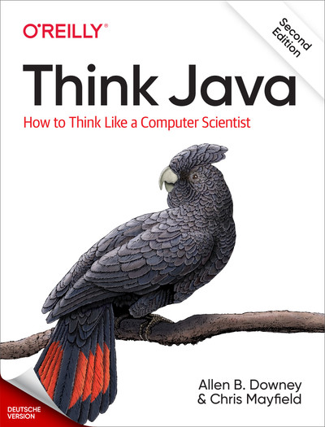
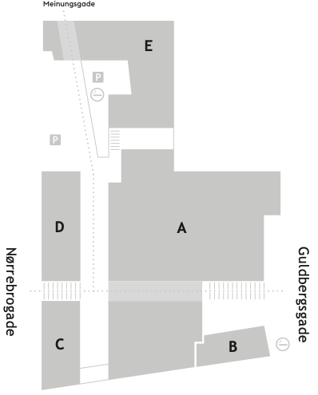
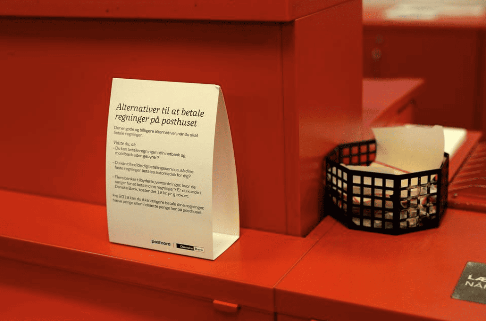
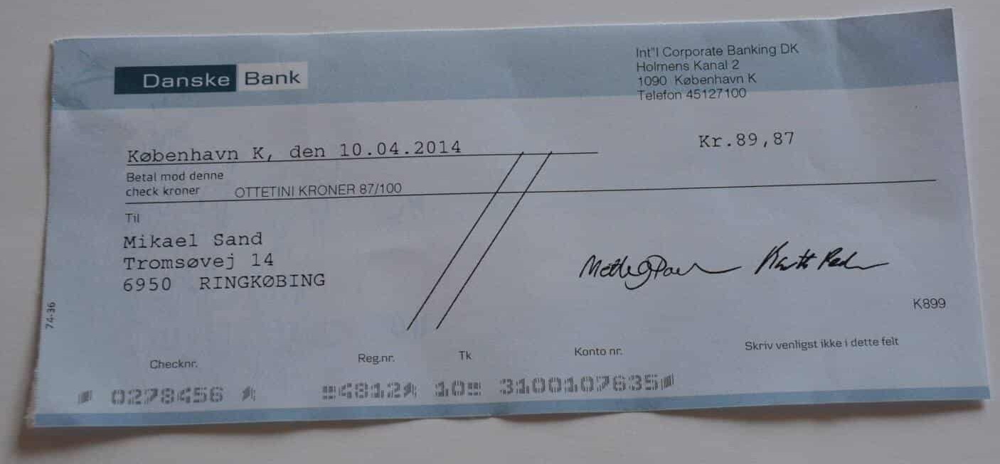
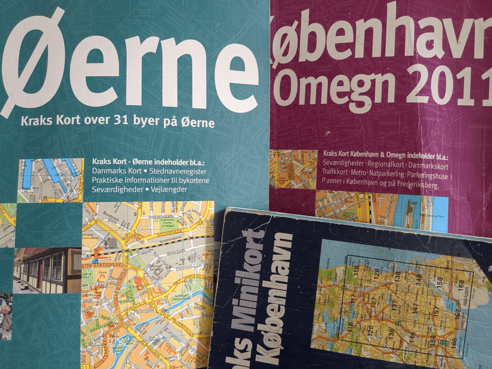

<!-- .slide: class="cover-2" -->
# Introdage

> Mens vi venter...
>
> lav et navneskilt
>

Notes:
- Husk A4 papir og tuscher
- Bed de studerende om at lave et navneskilt når de ankommer

---
<!-- .slide: class="o-academic-fire" -->
# Program
- Os og jer
- Studiet
- Find vej på EK
- Hvad laver en datamatiker?
- Rollen som studerende
- Hack dit studieliv
- Rundt i Studiehåndbogen


---

<!-- .slide: class="cover-7" -->
# Os og jer

--

Underviser i *Systemudvikling*


 
## *Lasse*

[LAVO@ek.dk](mailto:LAVO@ek.dk)

--

Underviser i *Virksomhed*

 
## *Stig*

[STSS@ek.dk](mailto:STSS@ek.dk)

--

Underviser i *Programmering*


## *Jakob*
[JANO@ek.dk](mailto:JANO@ek.dk)

--
<!-- .slide: class="cover-15" -->
## Jer

--
<!-- .slide: class="k-patrick-star" -->

- Tag 5 samtale-kort fra bunken heroppe
- Gå rundt i blandt hinanden
- Hils på hinanden med navn og stil et spørgsmål

--

Uddannelseschef på *Datamatiker* (og min chef)


# *Erik Christian Hansen*

... kommer forbi og siger hej i morgen

--

Leder på EK Digital (og min chefs chef)


# *Frederikke*

--

...og rektor på EK

<iframe width="750" height="422" src="https://www.youtube.com/embed/S11quPmFWkk?rel=0&showinfo=0&controls=0&privacy_mode=1" title="Velkommen til EK" frameborder="0" allow="accelerometer; autoplay; clipboard-write; encrypted-media; gyroscope; picture-in-picture; web-share" referrerpolicy="strict-origin-when-cross-origin" allowfullscreen></iframe>

Notes:
- Rektor vil gerne byde jer velkommen til EK

---
<!-- .slide: class="cover-8" -->
# Studiet

--

- 400 studerende
- 25 undervisere
- 5 semestre
- 150 ECTS

--

<style>
table.education {
	border-collapse: collapse;
	width: 100%;
	table-layout: fixed;
}
table.education tr {
	height: 50px;
}
table.education th, table.education td {
	font-size: 14px;
	border: 2px solid white;
	text-align: center;
	vertical-align: middle;
	font-family: Arial, sans-serif;
	font-weight: bold;
	color: white;
}
table.education th {
	background-color: #333;
	height: 50px;
}
table.education td {
	background-color: #fe4c61;
}
</style>
<table class="education">
<tr>
	<th>1. SEMESTER</th>
	<th>2. SEMESTER</th>
	<th>3. SEMESTER</th>
	<th>4. SEMESTER</th>
	<th>5. SEMESTER</th>
</tr>
<tr>
	<td rowspan="3">PROGRAMMERING 1<br>(15 ECTS)</td>
	<td rowspan="3">PROGRAMMERING 1<br>(15 ECTS)</td>
	<td rowspan="2">PROGRAMMERING 2<br>(10 ECTS)</td>
	<td rowspan="2">VALGFAG 1<br>(10 ECTS)</td>
	<td style="background-color: red;" rowspan="3">PRAKTIK<br>(15 ECTS)</td>
</tr>
<tr>
</tr>
<tr>
	<td rowspan="2">SYSTEMUDVIKLING<br>(10 ECTS)</td>
	<td rowspan="2">VALGFAG 2<br>(10 ECTS)</td>

</tr>
<tr>
	<td rowspan="2">SYSTEMUDVIKLING<br>(10 ECTS)</td>
	<td>SYSTEMUDVIKLING<br>(5 ECTS)</td>
	<td rowspan="3" style="background-color: red;">AFGANGSPROJEKT<br>(15 ECTS)</td>
</tr>
<tr>
	<td>TEKNOLOGI 1<br>(5 ECTS)</td>
	<td rowspan="2">TEKNOLOGI 2<br>(10 ECTS)</td>
	<td rowspan="2">VALGFAG 3<br>(10 ECTS)</td>
</tr>
<tr>
	<td>IT- OG FORRETNINGS-<br>UDVIKLING (5 ECTS)</td>
	<td>IT- OG FORRETNINGS-<br>UDVIKLING (5 ECTS)</td>
</tr>
</table>

--

8-9 eksamener

--

1. semester
	- Programmering 1 - *Mundtlig eksamen* (15 ECTS)  
2. semester
	- Programmering 1/Systemudvikling 1/IT- og forretn. 1 og Teknologi 1 - *Projekt og mundtlig eksamen* (45 ECTS)
3. semester
	- Programmering 2 - *Mundtlig eksamen* (10 ECTS)
	- Systemudvikling 2 - *Mundtlig eksamen* (10 ECTS)
	- Teknologi 2 - *Mundtlig eksamen* (10 ECTS)
4. semester
	- Valgfag 1 - *Prøve* (10 ECTS)
	- Valgfag 2 - *Prøve* (10 ECTS)
	- Valgfag 3 - *Prøve* (10 ECTS)
5. semester
	- Praktik - *Skriftlig eksamen* (15 ECTS)
	- Afsluttende projekt - *Projekt og mundtlig eksamen* (15 ECTS)
--
#### 1. semester

--

#### Programmering
"Hvordan man bygger software      
\- ved brug af værktøjer og metoder brugt i branchen"

--

#### Systemudvikling
"Alt det der støtter op om selve programmeringen  
– planlægning, design, kvalitetssikring"

--

#### IT- og forretningsudvikling
"Forstå dem der aftager softwaren,  
og betaler os for at lave dem"

--

#### Undervisningen

- Klasseundervisning
- Øvelser
- Problemløsning
- Diskussioner
- Studenter-præsentationer
- Gruppearbejde
- Større projekter med vejledning

--

#### Eksempeluge 1. semester

--
<style>
table.education {
	border-collapse: collapse;
	width: 100%;
	table-layout: fixed;
}
table.education tr {
	height: 50px;
}
table.education th, table.education td {
	font-size: 14px;
	border: 2px solid white;
	text-align: center;
	vertical-align: middle;
	font-family: Arial, sans-serif;
	font-weight: bold;
	color: white;
}
table.education th {
	background-color: #333;
	height: 50px;
}
table.education td  {
	background-color: #fe4c61;
}
</style>
<table class="education">
	<tr>
		<th></th>
		<th>MANDAG</th>
		<th>TIRSDAG</th>
		<th>ONSDAG</th>
		<th>TORSDAG</th>
		<th>FREDAG</th>
	</tr>
	<tr>
		<td>8:30 - 11:45</td>
		<td>PROGRAMMERING</td>
		<td></td>
		<td>PROGRAMMERING</td>
		<td></td>
		<td>IT- og FORRET-NINGSUDVIKLING</td>
	</tr>
	<tr>
		<td>12:30 - 14:00</td>
		<td></td>
		<td>SYSTEMUDVIKLING</td>
		<td></td>
		<td>PROGRAMMERING</td>
		<td></td>
	</tr>
</table>

--
... MEN skemaet kan ændre sig fra uge til uge

Se skemaet på [https://ums.ek.dk/

--

### Undervisningsmateriale

--



2\. udgave - gratis online: [https://greenteapress.com/wp/think-java-2e/](https://greenteapress.com/wp/think-java-2e/)

--


Gratis [LinkedIn Learning](https://www.linkedin.com/learning/) adgang med EK login

---
<!-- .slide: class="cover-1" -->
# Find vej på EK

--


- E: Datamatiker, Code Lab, cafe, studievejledningen
- A: Kantine, servicedesk, biblioteket, cykelparkering
- B: Studenterbaren

Notes:
- Vi er i næsten udelukkende i bygning E
- Kantinen er i bygning A
- Studenterbaren er i bygning B
- Gå ind fra Meinungsgade 8
- Cykelparkering i kælderen
- Ingen bilparkering

--
<!-- .slide: data-background-image="img/meinungsgade.jpg" -->

> Indgang fra Meinungsgade 8

--

#### Adgang med studiekort

Har I fået lavet studiekort?
...ellers [https://ekstudiekort.dk/](https://ekstudiekort.dk/)
--

#### Lokaler

**GBG.E236** betyder:
- Campus GBG, Guldbergsgade
- Bygning E
- 2\. sal
- Lokale 236

--
### Rygepolitik


Notes:
- Rygning er ikke tilladt på hele campus

--

#### Hjertestarter

**2 stk.**

- En i bygning A (ved receptionen)
- En i bygning E (ved lokale E.136)

--

#### Beredskabsplan

[https://mit.kea.dk/images/studiehaandbog/Beredskabsplaner/Beredskabsplan-maj-2022-studerende.pdf](https://mit.kea.dk/images/studiehaandbog/Beredskabsplaner/Beredskabsplan-maj-2022-studerende.pdf)

--

<!-- .slide: class="k-patrick-star" -->
#### Foto orienteringsløb på campus

- 30 min.
- Hold a 2-3 personer
- Besøg hvert sted på kortet
- Find det foto der passer til stedet

---
<!-- .slide: class="cover-5" -->
# Hvad kan en datamatiker?

--
<!-- .slide: data-background-image="img/bedstemor-and.png" -->
> ...hvad du kan sige, når bedstemor spørger, hvad du studerer?
--

#### Da jeg var barn...


Notes:
- Da jeg var barn skulle mine forældre på posthuset for at betale regninger, fx husleje

--

#### Da jeg var barn...



Notes:
- Hvis man bruge et stort beløb kunne man skrive en check, så kunne modtageren indløse den i sin bank.

--

#### Da jeg var barn...


Notes:
- Skulle man købe en rejse, skulle man gå til et rejsebureau.
- Rejsebureauet skulle kontakte flyselskabet for at booke billetter.
- SAS blev markedsleder da de begyndte at tilbyde online booking - et af Danmarks tidligste IT-projekter. De kunne tilbyde en rejse næste dag, hvilket var en kæmpe fordel for businesskunder.

--

#### Da jeg var barn...



--

Digitale produkter løser problemer for mennesker

--

Det danske samfund er i front, når det kommer til digitalisering   
 \- det er en kæmpe effektivitetsgevinst  
 \- mennesker kan brug deres tid på opgaver med mening i
 
--

... alt det kræver **digitale håndværkere** - som jer

--
<!-- .slide: class="k-patrick-star" -->
Brug 7 min til at tænke over:  
\- Hvilke digitale produkter bruger du i din hverdag?  
\- Hvilke problemer løser de for dig?

Notes:
- De der har forslag må gerne sige dem højt
---
<!-- .slide: class="cover-6" -->
# Rollen som studerende

--
#### Nye ord

- <strike>skole</strike>&nbsp;&nbsp;*uddannelse*
- <strike>elev</strike>&nbsp;&nbsp;*studerende*
- <strike>lærer</strike>&nbsp;&nbsp;*underviser*
- <strike>lektier</strike>&nbsp;&nbsp;*øvelser*

--

Der er **ingen** årskarakterer

--

... så du kan roligt sige, hvis der er noget du ikke forstår

--

Der er **ikke** krav om fremmøde

--
<!-- .slide: class="cover-9" -->

#### ... men det er dumt at blive væk

Notes:
- Vi ser en tydelig sammenhæng mellem fremmøde og beståelse af eksamen

--

#### 30 ECTS = en fuldtidsstilling
\- og du får SU for det

Notes:
- Du skal regne med at bruge 37 timer om ugen på studiet
- Det er et fuldtidsstudie
- Det er et fuldtidsjob

--

### En tillidserklæring
- du får SU
- du får en gratis uddannelse
- andre var kvalificerede, men fik ikke plads

--

Hvis du skal tage noget med fra i dag, så er det:

--
<!-- .slide: class="cover-3" -->
> ## Mød op!
>
> Har du en dårlig dag, så mød op alligevel.
>
> Den dårlige dag er bedre her - end derhjemme

Notes:
- Det er bedre at komme en time for sent end ikke at komme

--

Din fremtid som software udvikler er også
- #### fælles ejerskab
- #### vidensdeling
- #### samarbejde
- #### pair programming

Notes:
- Kollegaskab, vidensdeling, fælles ejerskab for software og projekter er en essentiel del af dit fremtidige job som softwareudvikler ... og en efterspurgt kompetence hos udviklere. 

--

Tænk på dit studie som et

## arbejdsfælleskab

Notes:
- Vi behøver ikke at være *best pals*
- Men opgaver løses bedst i grupper - så bidrag hvor du kan
- Måske er du god til macOS, måske fangede du hurtigt, hvad øvelsen gik ud på 

--

Feedback fra virksomheder: 
#### Ikke nok at være god til at kode

--

## Soft skills
- Teamwork
- Kreativitet
- Mentoring/vidensdeling
- Kommunikation

Notes:
- Teamwork:
	- Håndtere uenigheder og forskellige meninger
	- Lytte til andres ideer og give konstruktiv feedback
	- Bidrage til et positivt arbejdsmiljø
- Kreativitet:
	- Hvordan løser vi et problem digitalt - så det giver mening for brugeren - er robust for fejl - kan imødese fremtidige behov
	- Være åben for nye ideer og tilgange
- Mentoring/vidensdeling:
	- At dele viden og erfaringer med andre
	- At hjælpe andre med at vokse og udvikle sig
- Kommunikation:
	- At kunne forklare komplekse tekniske emner på en simpel måde - bl.a. til ikke-tekniske personer, herikluderet kunder
	- At kunne lytte og forstå andres behov og perspektiver
--

Det øver vi også her på studiet  
#### ... så *mød op*

---
<!-- .slide: class="cover-11" -->

# Hack dit studieliv

--

Det handler om den der


--

### Repetition

--

- Nye informationer lagres først i **korttidshukommelsen**
- Gentagelse flytter viden til **langtidshukommelsen**

--

Undervisningen kommer omkring emnerne flere gange
- Forberedelse
- Undervisning
- Øvelser
- Projekter
- Forberedelse til eksamen

--

### The *spacing effect*


Det er bedre at øve klaver  
**10 minutter hver dag**  
end 1 time én gang om ugen

Notes:
- Min søn startede til klaver i efteråret
- Hans klaverlærer sagde at det er bedre at øve 10 minutter hver dag end 1 time én gang om ugen
- Jeg husker at jeg selv gik til guitar som barn. Jeg øvede mig en time hver dag før jeg skulle til guitar.
- Min søn er vildt meget bedre til klaver end jeg var til guitar
- Samme arbejdsbyrde - men mere effektivt

--

### Nytårsforsæt

--
<!-- .slide: class="k-patrick-star" -->
Ræk hånden op, hvis du har haft et **nytårsforsæt**?

--
<!-- .slide: class="k-patrick-star" -->
Hold hånden oppe, hvis du har **holdt** dit nytårsforsæt?

--

Har du haft tanken:

> ### Hvad er der galt med mig, når jeg ikke kan holde mine nytårsforsætter?

--

God nyhed:
> ### Det er ikke dig, der er noget galt med

--

Motivation holder 14 dage
### \- vaner får dig i mål

Notes:
- Vi mennsker er vanedyr
- De færreste kan drive noget frem alene med viljestyrke
- Det meste af det vi gør, er vaner
- Det er ikke nemt at etablere nye vaner
- Du kan udnytte andre vaner når du etablerer nye vaner

--

#### Det snedige trick

Du har 14 dage til at etablere et nyt system, der er pærelet at følge

--

Eksempel
> Jeg vil gerne komme i bedre løbeform

--

Dårligt system (for Jakob)
- Jeg skal løbe mandag og torsdag når børnene er faldet i søvn

... FAIL!

Notes:
- Jeg kan ligeså godt gøre det i tirsdag og fredag
- Jeg er træt og kan ikke tage mig sammen til noget om aftenen

--

Godt system
- Jeg skal løbe kort tur hver dag kl. 7:00
- Jeg sætter min alarm til at ringe kl. 22:00
- Jeg lægger mit løbetøj frem
- Jeg sætter min alarm til kl. 6:30
- Jeg står op og tager løbetøjet på

--

Et andet godt system
- Jeg skal løbe til/fra arbejde
- Jeg tager mit løbetøj på når jeg står op
- Jeg har håndklæde og sæbe på arbejde
- Jeg løber til arbejde og tager bad der

--

Et tredje godt system (aftaler er godt!)
- Jeg har en aftale med min kollega om at løbe efter arbejde hver onsdag og fredeag
- Jeg har løbetøj hængende på mit arbejde
- Jeg tager bad på arbejde

--


--

#### Se den her
<iframe width="560" height="315" src="https://www.youtube.com/embed/xT_YaduPYlk?si=tWHai8SxVnuK0tDi?rel=0&showinfo=0&controls=0&privacy_mode=1" title="YouTube video player" frameborder="0" allow="accelerometer; autoplay; clipboard-write; encrypted-media; gyroscope; picture-in-picture; web-share" referrerpolicy="strict-origin-when-cross-origin" allowfullscreen></iframe>

Notes:
- Jeg så den her talk på en udviklerkonference engang
- Den var virkelig inspirerende, fordi han deler sin rejse med at etablere nye vaner
- Og samtidig kommer han ind på forskning om vaner og motivation
- Hvis I mangler noget at lave i aften, så kan I overveje at se den

--
<!-- .slide: class="o-patrick-star" -->
- 5 min til at tænke over
	- Overvej hvad der vil blive svært for dig i dit studieliv
	- Hvad kan du gøre for at etablere et godt system?
- 10 min hvor du fortæller din sidemakker om dit nye system (5 min hver)
- (Måske kan I lave en aftale med hinanden?) 
--

#### Der er hjælp og vejledning

--


--

#### Code Lab
- Åbent mandag-fredag kl. 8.30-11.45 og 12.30-15.45 (bemandet)
- Dygtige studerende på senere semestre
- Du kan få hjælp til at:
  - forstå opgaver
  - forstå og skrive kode
  - komme videre i et projekt

--

#### Studievejledningen

- *"Jeg er i tvivl om jeg har valgt det rigtige studie"*
- *"De andre i studiegruppen irriterer mig og vi kan ikke arbejde sammen"*
- *"Jeg er dumpet en eksamen - hvad gør jeg?"*
- *"Jeg er stresset - hvad skal jeg gøre?"*
- *"Jeg bliver mega nervøs til eksamen - hvad kan jeg gøre?"*
- (og mange andre ting)
--

<iframe width="750" height="422" src="https://www.youtube.com/embed/fRYoFGXqCzQ?rel=0&showinfo=0&controls=0&privacy_mode=1" title="Studievejledningen" frameborder="0" allow="accelerometer; autoplay; clipboard-write; encrypted-media; gyroscope; picture-in-picture; web-share" referrerpolicy="strict-origin-when-cross-origin" allowfullscreen></iframe>

--

#### Studievejledning

- studievejledning@ek.dk
- 36 15 45 15

--

# AI og læring

--

Vi ser, at
- AI *kan* være et nyttigt værktøj i læringsprocessen,  

men vi ser også at 
- studerende får **dårligere færdigheder** og 
- har sværere ved at få udbytte af studiet - og gennemføre det

--


Notes:
- Her en lidt sjov tegning hvordan man kan udvikle en bil (set fra en software udviklers synspunkt)
- Der er to traditioner indenfor software udvikling, vandfaldsmetoden og den agile metode
- I vandfaldsmetoden planlægger vi hele forløbet og går frem efter planen. Således lægger vi hjul ud, forbinder dem med aksler osv.
- Den agile metode opnår det samme men i en iterativ metode, hvor man gradvist øger omfanget, men har et fungerende produkt i alle stadier. Dvs. først et skateboard, så et løbehjul etc, til sidst en bil
- I AI er det ret nemt at generere en fuld applikation. Det vi ofte ser her, er at udvikleren ender med at sidde og fjerne kode fra en fuld applikation indtil den gør det den skal. Det er en svær måde at lære på, da du som udvikler ikke er med i opbygningen og derfor har svært ved at redegøre for hvad du har lavet. Det er især et problem hvis du prøver at lære noget.

--

#### Faldgrupper ved AI

1. Overfladisk læring
2. Afhængighed
3. Mindre kreativitet og problemløsning
4. Misser at "fejl" er en vigtig del af læringsprocessen
5. Falsk sikkerhed
6. Plagiat og etik

Notes:
- Overfladisk læring
	- Hvis man altid får svaret serveret, risikerer man at springe over den dybe forståelse.
	- Man kan “løse opgaven” uden at kunne forklare løsningen bagefter.
	-  Eksempel: En SQL-forespørgsel genereret af ChatGPT virker – men man kan ikke selv tilpasse den, når kravene ændrer sig.
- Afhængighed
	- Risiko for at man altid tyr til ChatGPT i stedet for at tænke selv.
	- Kan sammenlignes med at bruge lommeregner uden nogensinde at lære hovedregning → man kan komme til at mangle fundamentale færdigheder.
- Mindre kreativitet og problemløsning
	- En stor del af at lære softwareudvikling er at finde løsninger på uklare problemer.
	- Hvis man altid starter med at spørge AI, kan man blive mindre trænet i selv at bryde problemer ned.
- "Fejl" er en vigtig del af læringsprocessen
	- At lave fejl og debugge selv er en vigtig del af at blive god til programmering.
	- Hvis ChatGPT retter det hele med det samme, mister man muligheden for at lære af egne fejl.
- Falsk sikkerhed
	- ChatGPT kan “hallucinere” og give et overbevisende men forkert svar.
	- Hvis studerende ikke lærer at være kritiske, kan de tage forkerte ting for gode varer.
- Plagiat og etik
	- Risiko for at aflevere AI-genereret tekst/kode uden at angive kilde.
	- Kan have konsekvenser
--

#### Fra studieordningen
Som udgangspunkt må du bruge værktøjer med kunstig intelligens (...), i forbindelse med eksamensopgaver (...), medmindre andet fremgår eksplicit af studieordningen eller opgavebeskrivelsen.

Men du skal være meget opmærksom på at lave korrekte referencer. Ellers vil EK betragte det som eksamenssnyd, da det vil være i strid med eksamensbekendtgørelsen, hvis du afleverer en besvarelse eller dele af en besvarelse, som fx er udarbejdet af en AI/chatbot, som om det var din egen.

--

#### Do's and Don'ts

- ✅ Brug AI til at få hjælp til at forstå koncepter
- ✅ Brug AI til at forstå fejl du får
- ❌ Brug *ikke* AI auto-completion når du koder
- ❌ Brug *ikke* AI til at løse opgaver for dig
- ❌ Tro ikke at du har forstået opgaven, bare fordi du har læst AI' svar

--

#### ❌ Don't - eksempel
```txt
Løs opgaven herunder i Java:    
Skriv en metode der tager et array   
af int som parameter og returnerer   
summen af alle elementerne i arrayet.
```

--

#### ✅ Do - eksempel
```txt
Jeg er ny i Java. Forklar mig hvad en static variabel er.
```

--

#### ✅ Do - eksempel

```txt
Jeg er ny til Java. Jeg har skrevet dette program,   
men jeg får en fejl: error: ';' expected. Hvad     
betyder det, og hvordan retter jeg det?    
 
public class Main {   
   public static void main(String[] args) {   
       System.out.println("Hej verden")    
   }
}
```

---
<!-- .slide: class="cover-10" -->
# Rundt i Studiehåndbogen

--

- Vi skal have adgang til mail, wifi, ItsLearning, etc.
- Vi bruger Studiehåndbogen til at finde informationer og guides
- På din computer: [https://mit.kea.dk/studiehaandbog](https://mit.kea.dk/studiehaandbog)

--
<!-- .slide: class="o-squidward" -->
#### Wifi

- Søg på studiehåndbogen efter "wifi"
- Følg instruktionerne for at få adgang til wifi

--
<!-- .slide: class="o-spongebob" -->
#### Studiemail og login

- Søg på studiehåndbogen 
	- "KEA login"
	- "KEA mail"
- Følg instruktionerne

--
<!-- .slide: class="o-focus-blue" -->
#### ItsLearning
- også kendt som *Fronter*
- Søg på studiehåndbogen efter "ItsLearning"
- Log ind med dit KEA login
- Find dit klasse*rum* og undervisningsplaner

--
<!-- .slide: class="o-daylight" -->
#### Servicedesk og Serviceportalen
- Søg på studiehåndbogen efter "Servicedesk"
- [servicedesk@ek.dk](mailto:servicedesk@ek.dk)
- Frontdesk i bygning A ved receptionen

--
<!-- .slide: class="o-poolside-study" -->
#### UMS
- Søg på studiehåndbogen efter "UMS"
- Log ind med dit KEA login
- Se dit skema for semesteret

--
<!-- .slide: class="o-pencil-grey" -->
#### Office 365
- Søg på studiehåndbogen efter "Office 365"
- Log ind med dit KEA login
- Find Office 365 apps som Word, Excel, PowerPoint, OneDrive og Teams

--

<!-- .slide: class="o-tinky-winky" -->
#### Teams

- Nogle lektioner foregår i Teams
- Lad os teste at alle kan logge ind i Teams

--
<!-- .slide: class="o-bluey" -->
#### LinkedIn Learning

- LinkedIn Learning kan bruges som forberedelse til undervisningen
- Opret en konto i LinkedIn, hvis du ikke har en
- Tilknyt din KEA-mail til LinkedIn Learning
- Find kurset **Learning Java 17** af **Kathryn Hodge**
