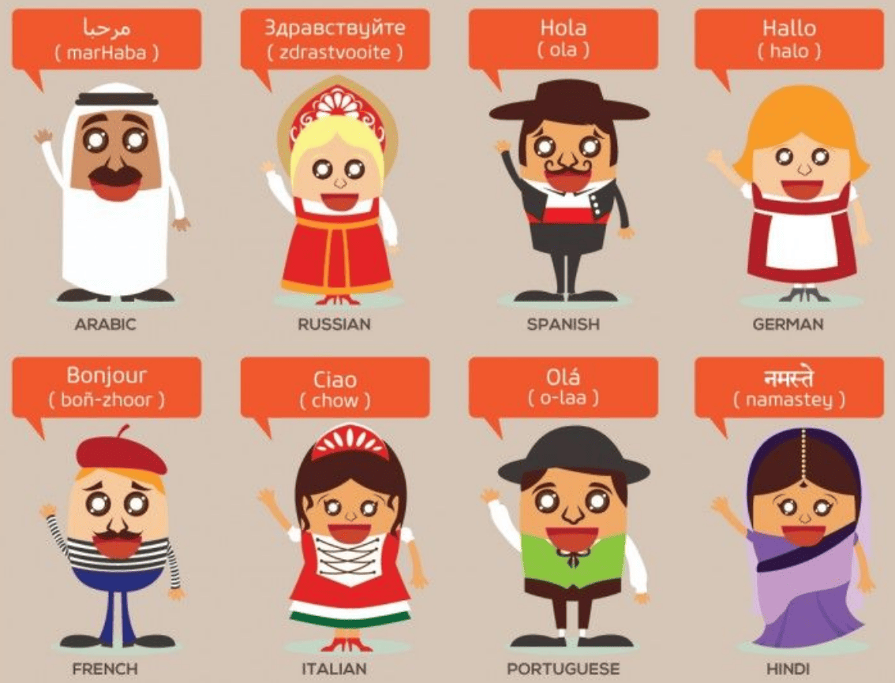
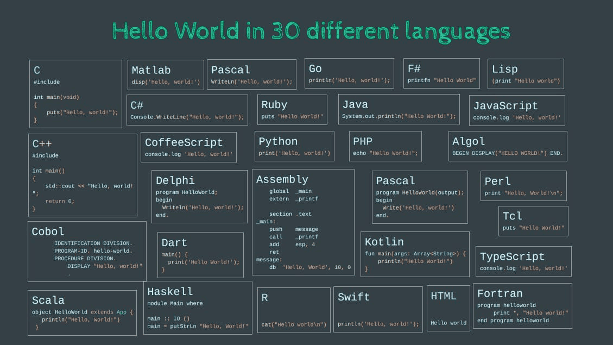

<!-- .slide: class="ek-academic-fire" -->

# Introduktion til kurset

---
<!-- .slide: class="k-sunlit-energy" -->

## Program

- 08:30 Praktisk information  
- 09:00 Installering af Java og IntelliJ  
- 10:00 Pause  
- 10:15 Første program  
- 11:30 Opsamling  

---
<!-- .slide: class="k-bluey" -->

# Praktisk information

---

# Hardware og software

--

Computeren er en **standardmaskine**, der kan udføre mange **forskellige opgaver**

Notes:
- Computeren er en standardmaskine, der kan udføre mange forskellige opgaver

--

**Hardware**
- **CPUen** **beregner** og udfører instrukser
- **RAM** er **midlertidig** arbejdshukommelse
- **Harddisk** er **permanent** hukommelse - filer

Notes:

- CPU'en er hjernen i computeren, der udfører beregninger
- RAM er den midlertidige hukommelse, der bruges til at gemme data, fx Word du har åbnet og dokumentet du arbejder på
- Harddisken er den permanente hukommelse, der bruges til at gemme data, fx programmer, billed-filer og dokument-filer
- Operativsystemet er det, der styrer computeren og gør det muligt at bruge den 

--

**Software**
- **Operativsystem** styrer computeren
    - fx Windows, MacOS, Android, iOS
- **Drivere** får computeren til at kommunikere med hardware
    - fx keyboard, printer, skærm
- **Applikationer** er det, vi bruger computeren til
    - fx Word, Photoshop, browsere, spil

Notes:
- At skrive software, dvs. programmere, er
- powerfuldt, fordi du kan løse mange forskellige problemer
- kreativt, fordi du skal forstå problemet og finde en løsning

--

### 5 min med sidemand
<!-- .slide: class="ek-campus-green" -->

>  Hvilke problemer løser vi med software i dag, som tidligere var bøvlet

Notes:
- Studende: Nævn eksempler på programmer, der løser et problem, som var vanskeligt at løse uden computer
- Eksempler:
    - bankkonti (Du skal ikke i bank hver gang du vil se din saldo)
    - kreditkort (Du behøver ikke at have kontanter på dig hele tiden) 
    - Excel regneark
    - tekstbehandling (på en skrivemaskine var det svært at rette tastefejl)
    - billedredigering (tidligere måtte du vente på at filmen var fremkaldt)
    - VST instrumenter (du kan ikke have et rigtigt trommesæt i din lejlighed)
    - Reservationssystemer (SAS blev førende, da de fik et reservationssystem, fordi man kunne ringe og booke en plads på et fly næste dag)
    - GPS og Google Maps
    - Streaming (Du kan have alle dine film og musik på din telefon)
    - Sociale medier (Du kan holde kontakt med venner og familie uden at skulle ringe eller skrive breve)

---

# Programmeringssprog

--




Notes:

Ligesom vi har mange forskellige sprog til at kommunikere med hinanden, har vi også mange forskellige programmeringssprog til at kommunikere med computeren
- Forskellige sprog har forskellige ord og syntaks (dvs. regler for rækkefølgen af ord i en sætning)

-- 



Notes:
- 'Hello, World' programmet i 30 forskellige programmeringssprog
- Et simpelt program, der viser teksten "Hello, World!" på skærmen
- Forskellige sprog til forskellige opgaver
- Nogle sprog er bedre til nogle opgaver end andre
- Nogle sprog er lettere at lære end andre
- Nogle sprog er hurtigere end andre
- Nogle sprog er mere populære end andre

--


Notes:
- TIOBE indekset viser de mest populære programmeringssprog
- Java er et af de mest populære programmeringssprog

--

Java er et **general purpose programmeringssprog**

Notes:
- du kan løse mange forskellige opgaver med det
    - apps
    - hjemmesider
    - spil
- modsat "domæne specifikke sprog", der kun bruges til én ting
- nogle af jer har måske hørt om domæne specifikke sprog:
    - f.eks. SQL, der kun bruges til at spørge databaser
    - f.eks. HTML og CSS, der kun bruges til at lave hjemmesider
    - f.eks. Scratch, der kun bruges til at lave spil

--

<!-- .slide: data-background-image="img/minecraft.png" -->

Notes:
- Minecraft er lavet i Java


---

# Syntaks

--

**Syntax** - regler for rækkefølge af ord

--

>"spiser en sandwich jeg"

**Udsagnsled** + **grundled** + **genstandsled**

_eller_

>"jeg spiser en sandwich" 

**grundled** + **udsagnsled** + **genstandsled**

Notes:
- Korrekt syntaks er vigtigt for at vi kan forstå hinanden

--

**Korrekt**

```java
int age = 18;
```

**Forkert**

```java
age = 18 int;
```

```java
int = 18 age;
```

```java
INT age = 18;
```

--

**Korrekt**

```java
System.out.println("Hello, World!");
```

**Forkert**

```java
System.out.println Hello, World!;
```

```java
System.out.println(Hello, World!");
```

```java
System.out println("Hello, World!");
```

--

**Korrekt**

```java
public class HelloWorld {
    public static void main(String[] args) {
        System.out.println("Hello, World!");
    }
}
```

**Forkert**

```java
public class HelloWorld {}
    public static void main(String[] args) {
        System.out.println("Hello, World!");
```

```java
public class HelloWorld {
    public static void (String[] args) {
        System.out.println("Hello, World!");
    }
}
```

```java
public HelloWorld {
    public static void main(String[] args) {
        System.out.println("Hello, World!");
    }
}
```

Notes:

- Du skal ikke skrive din kode om for at køre den på en anden platform
- Mennesker skriver kildekode i en tekstfil med endelsen `.java`
- Du kompilerer den til byte-code, som er en binær fil med endelsen `.class`
- Nu kan ingen læse din kildekode
- Et opertivsystem forstår maskinkode
- Når du installerer Java, kører der en Java Virtuel Machine (JVM)
- JVM forstår byte-code og omsætter det til maskinkode

---

<!-- .slide: class="ek-campus-green" -->
## Første program

--
<!-- .slide: class="ek-campus-green" -->

1. Lav en fil, der hedder `HelloWorld.java`  
2. Skriv følgende kode i filen og gem den:  
```java
public class HelloWorld {
    public static void main(String[] args) {
        System.out.println("Hello, World!");
    }
}
```

--
<!-- .slide: class="ek-campus-green" -->

3. Compile med
```bash
javac HelloWorld.java
```

4. Kør programmet med
```bash
java HelloWorld
```

5. Hvad sker der?

---

## Kompilering

--

Compileren `javac` oversætter kildekode `HelloWorld.java` til bytecode `HelloWorld.class`

```bash
javac HelloWorld.java
```
Notes:
- javac er Java compiler

---
## Java bytecode

er en binær fil, der ender på `.class`

Notes:
- binær fil = 0'er og 1'er
- det er til computeren
- det er det, der bliver genereret når vi kompilerer vores kildekode
- det er det, der bliver kørt af Java Virtual Machine (JVM)
- det er det, der gør at Java kan køre på mange forskellige platforme

---

## Whitespace

- mellemrum, tabulatorer og linjeskift
- **ikke** vigtigt for computeren

--

```java
public class HelloWorld {
    public static void main(String[] args) {
        System.out.println("Hello, World!");
    }
}
```

er **korrekt** syntaks

--

```java
public class HelloWorld {
public static void main(String[] args) {
System.out.println("Hello, World!");
}
}
```

er **også korrekt** syntaks
--

```java
public class HelloWorld { public static void main(String[] args) { System.out.println("Hello, World!"); } }
```

er **også korrekt**

--

Hvorfor synes I vi skal bruge **indrykning**?

Notes:
- Indrykning gør det lettere at læse koden

---
<!-- .slide: class="k-sunlit-energy" -->
Tre ting du tager med fra fra i dag?