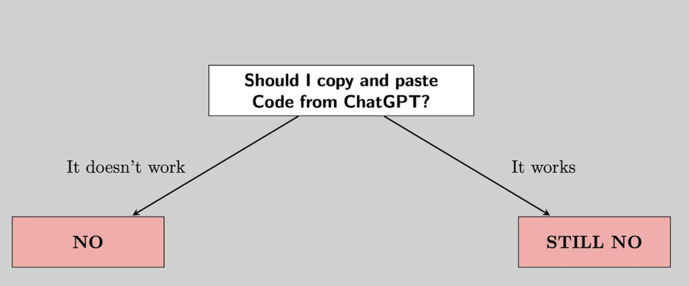
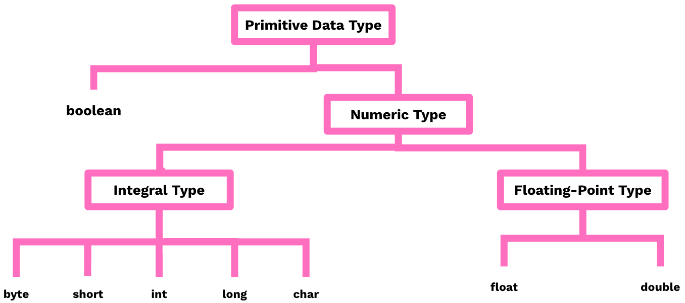
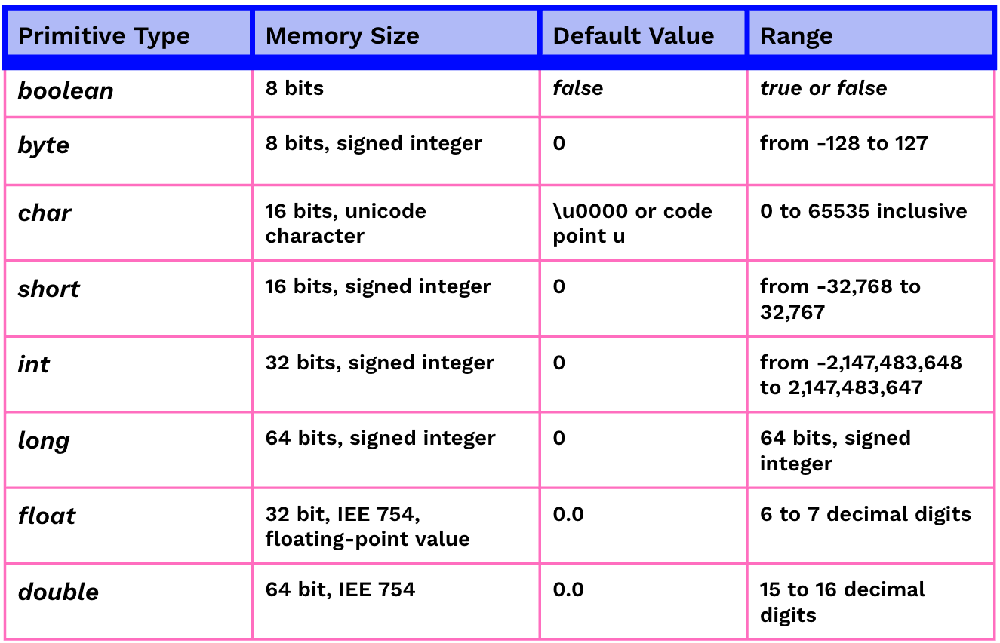
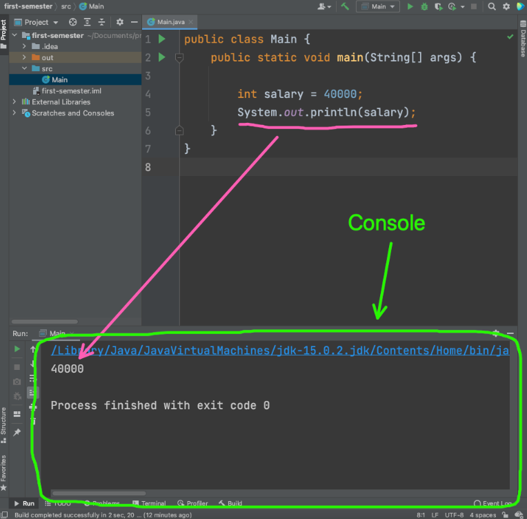

<!-- .slide: class="kea-dark" -->

# Variabler og expressions

---
<!-- .slide: class="kea-dark" -->

# Program

- 08:30 Velkomst praktisk, slides
- 09:00 Igang med øvelser i grupper
- 10:00 Pause
- 10:15 Øvelser fortsat
- 11:30 Opsamling, forberedelse til næste gang

---

### I dag

- Variabler
- Operatorer
- Expressions


--

En variabel er...

--

**en "boks"** i computerens hukommelse, hvor du kan **gemme data**

--

en variabel har et **navn** og en **datatype**, fx

> ```java
> int age;
> ```
>
> dvs.
>
> `datatype` `navn`;

Notes:

- fx et tal, et bogstav eller sand/falsk

--

`int age;` kalder vi, at **deklarere** en variabel 

--


--

# Heltal

engelsk: `int`eger

```java
int age = 25;
```

--

# Decimaltal

engelsk: `float`ing points

```java
float height = 178.2;
```

Notes:
Bemærk engelsk decimal er '.' og ikke ',' som på dansk.

--

# Bogstav

engelsk: `char`acter

```java
char initial = 'J';
```

--

# Sand/falsk

engelsk: `bool`ean

```java
bool hasBirthdayToday = false;
```

Notes:
- Opkaldt efter engelsk matematiker George Boole

--

# Quiz

Hvilken type er?

--

```java
??? price = 299.25;
```

--

```java
??? isLoggedIn = false;
```

--

```java
??? postcode = 4000;
```
--




## Variabel = beholder af en værdi

int  **x**  = 22;

## Operator = symbol der udfører udregning

3  **+**  5;

## Expression = Simpel værdi eller sæt af operatorer der producerer en værdi

 3 + 5; 

## Variabler

-   For at danne en variabel, skriver man først navnet på ens variabel.
-   Derefter skriver man et lighedstegn = følgende med værdien man gerne vil definere ens variable med.
-   **x** er en variabel.
-   **\=** kaldes en tildelingsoperator (assignment operator). Den tildeler værdien på højre side til variablen til venstre.

## Variabler


## Variabler

For at et program kan arbejde med data, er computeren nødt til at reservere en del af **hukommelsen** til arbejdet. Variablen skal have et navn, så det er muligt at henvise til den.

En variabel kan grundlæggende bruges på tre måder:

1.  Den kan **erklæres**, hvilket betyder at der allokeres plads i hukommelsen samt gives et navn og en datatype.
2.  Den kan **tildeles** en værdi.
3.  Dens værdi kan **anvendes**.

## Hvad er en datatype?

-   En datatype er en klassificering af hvilken typer data man har at gøre med.
-   Primitive Data Typer:
-   **boolean**, som kan antage to sandhedsværdier, True for sandt, og False for falsk.
-   **int**, som repræsenterer heltal, fx -1, 2, 44, 42, 69
-   **float**, som er decimaltal, fx -1.12, 3.1415, 1.4423, 2/3
-   Reference Data Type:
-   **string**, som er et stykke tekst, fx ”Se mor! Jeg koder i JAVA!” eller ”Jeg er 25 år gammel”

## Hvad er en datatype?





## Naming convention

-   Variabel navne må kun indeholde bogstaver, tal eller underscore\_
-   Variable er ”case-sensitive”, dvs **TALLET\_fem** og **tallet\_fem** er to forskellige variabler.
-   Variabel navne skal være beskrivende.
-   Hvis du har flere ord, kan du adskille ordene med en understregning, eller bruge camelCase.
-   Ingen tomme mellemrum!

## Variabel Typer


## Printe Variabler

```java

                        int salary = 400000;
                        System.out.println(salary);
					
```



## Kode Kommentar

-   En tekstlinje som starter med //
-   Computeren ikke kan oversætte det. (hoppe over)
-   Det gør det nemmere for en selv og andre at huske: hvordan koden virker, hvad ens kode betyder.
-   Til at udkommentere ens kode, hvis det f.eks. ikke skal bruges på nuværende tidspunkt, men måske senere.
-   Hvad man mangler at programmere, hvilke fejl der er.
-   Hvad mangler der i koden.

## final

```java

                final String name = "Nynne";
                name = "Dorte"; // Java throws an error!!
                
```

## Operators & Expressions

An **expression** is a simple value or a set of operations that produce a value.

3  **+**  5;

## Operators & Expressions

An expression is a simple value or a set of **operations** that produce a value.

-   **+** addition
-   **\-** subtraction
-   **\*** multiplication
-   **/** division
-   **%** modulus

## Mere komplekse Expressions

```java

                    result = 3 * 5 / 5 + 1 
                    // will this java code run??
                    
```


## Rækkefølge på operations


## main

-   **public** access modifier gør metoden tilgængelig overalt i din application.
-   **static** sørger for at gøre din metode til en class method i stedet for en instance method - uden at du behøver instanciere den først.
-   **void** metoden må ikke returnere noget - andet end void.
-   **main()** giver programmet et start punkt, kan ikke udføres uden.

## Shortcuts


**main** giver public static void main()


**sout** giver System.out.println();