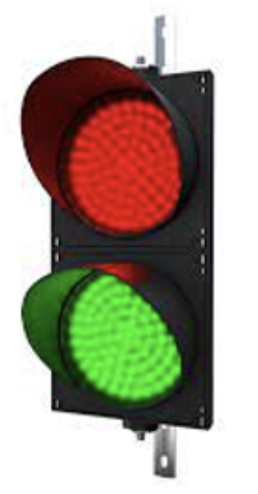

<!-- .slide: class="kea-red" -->

# Input og Output

---
<!-- .slide: class="kea-dark" -->

## Program

- 08:30 Input og Output 
- 09:00 Øvelser  
- 10:00 Pause  
- 10:15 Vi fortsætter med øvelser  
- 11:30 Opsamling  

---

# Klassen `System` 

- Vi har brugt `System.out.println` til at udskrive tekst til skærmen en del gange.

- Hvad er `System.out`?

Notes:

- DEMO 

```java
System.out.println(System.out); // java.io.PrintStream@15db9742
```

--

`HelloWorld.java`:
```java
public class HelloWorld {
    public static void main(String[] args) {
        System.out.println("Hello, World!");
    }
}
```

`System.java`:
```java
public class System {
    public static final PrintStream out = new PrintStream(...);
    // ...
}
```

`PrintStream.java`:
```java
public class PrintStream {
    public void println(String s) {
        // ...
    }
}
```

Notes:
- Her ser vi et kaldehierarki, øverst vores `HelloWorld` klasse, som I allerede kender.
- `System` er en klasse, der findes i Java's standardbibliotek, der giver adgang til fx at skrive til konsollen og læse fra input.
- `out` er en variabel af typen `PrintStream`, der bruges til at udskrive tekst til konsollen.
- `println` er en metode i `PrintStream`, der udskriver en linje tekst til konsollen.

--

# System.in

`System.java`:
```java
public class System {
    public static final InputStream in = new InputStream(...);
    // ...
}
```

`InputStream.java`:
```java
public class InputStream {
    public int read() {
        // ...
    }
}
```

En `int`? GYS!

Notes:

- DEMO:
    `HelloWorld.java`:
    ```java
    public class HelloWorld {
        public static void main(String[] args) {
            InputStream input = System.in;
            int data = input.read();
            System.out.println("Data read: " + data);
        }
    }
    ```
- InputStream's `read` returnerer `int`, dvs. tal?
- Det er ikke så nemt at arbejde med. Vi har brug for en klasse, der giver os nogle datatyper vi kan bruge direkte, som `String`, `int`, `double` osv.

--

## Klassen `Scanner`

`Scanner.java`:
```java
import java.util.Scanner;
public class Scanner {
    public String nextLine() {
        // ...
    }

    public int nextInt() {
        // ...
    }

    public double nextDouble() {
        // ...
    }
}
```


--

## Scanner Class

Du kan tilgå brugerens input med metoden **nextLine** og gemme input i et variabelnavn:

```java
myVariableName = input.nextLine();
```

--

## Scanner Types

```java
String myVariableName = input.nextLine();
input.nextInt();
input.nextDouble();
```

--

## Comments

```java
public class Example {
    public static void main(String[] args) {
        // Her er en linje kode kommentar

        /*
        Her er der
        flere linjer
        med kode kommentarer!
        */
        int myNumber = 1;
        // String myString = "hej!";
    }
}
```

--

## If else struktur:

Betinget udførelse med to muligheder:

```java
if(color.equals("rød")){
    System.out.println("Rødt lys");
}
else{
    System.out.println("Grønt lys");
}
```



--

## If – else if – chaining

Betinget udførelse med flere muligheder:

```java
if(color.equals("rød")){
    System.out.println("Rødt lys");
}
else if (color.equals("gul")){
    System.out.println("Gult lys");
} else {
    System.out.println("Grønt lys");
}
```


