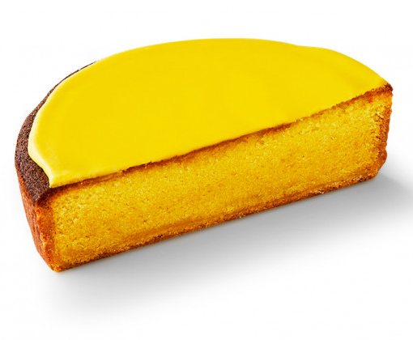
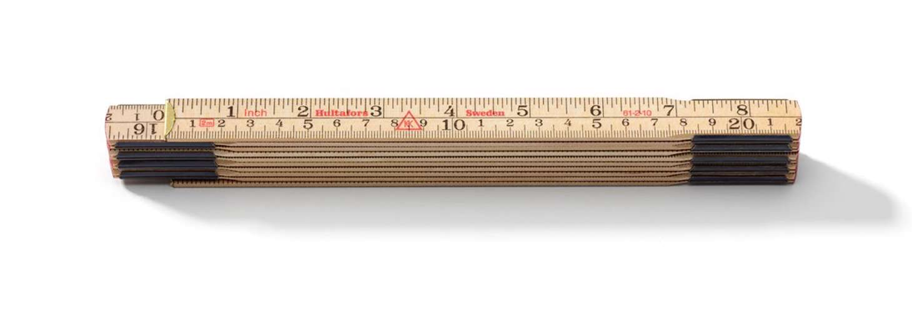
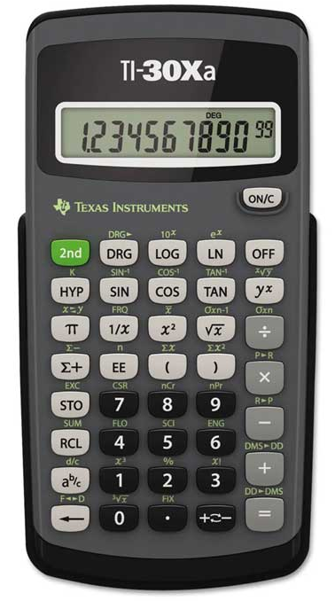

<!-- .slide: class="cover-13" -->

# Metoder

---
<!-- .slide: class="k-sunlit-energy" -->

## Program

- 08:30 Metoder
- 09:00 Øvelser  
- 10:00 Pause  
- 10:15 Vi fortsætter med øvelser  
- 11:30 Opsamling  

---

# Metoder



--

```java
public class CakeRecipe {
    public static void main(String[] args) {
        System.out.println("Afmål 300 g smør");
        System.out.println("Put det i skålen");
        System.out.println("Afmål 200 g sukker");
        System.out.println("Put det i skålen");
        System.out.println("Afmål 100 g mel");
        System.out.println("Put det i skålen");
        System.out.println("Pisk æggehvider fra 3 æg");
        System.out.println("Put det i skålen");
        System.out.println("Put dejen i en bageform");
        System.out.println("Bag i ovnen i 30 minutter");
    }
}
```
Notes:

- Kan I huske, at jeg sagde, at et program er som en opskrift?
- Computeren udfører statements i rækkefølge, ligesom vi følger en opskrift trin for trin.
- I vores program har vi en klasse `CakeRecipe`. Og for nu kan vi tænke på klasser som en slags container for vores kode, som vi kan organisere vores kode i.
- Vi kommer tilbage til klasser senere i kurset.
- I dag skal vi lære om metoder
- I alle de programmer, vi har skrevet indtil nu, har vi haft een metode, nemlig `main` metoden.
- `main` metoden er lidt speciel, fordi det er den metode, der bliver kaldt, når vi kører vores program.

- Men det er ikke særlig overskueligt at have alle instruktionerne i `main` metoden.
- Og nogle gange kommer vi til at gentage os selv.

- "Put det i skålen" er gentaget.
- Hvis jeg skal ændre opskriften, skal jeg ændre det flere steder - med fare for at lave fejl.

--

```java [4,6,8,10,15-17]
public class CakeRecipe {
    public static void main(String[] args) {
        System.out.println("Afmål 300 g smør");
        addToBowl();
        System.out.println("Afmål 200 g sukker");
        addToBowl();
        System.out.println("Afmål 100 g mel");
        addToBowl();
        System.out.println("Pisk æggehvider fra 3 æg");
        addToBowl();
        System.out.println("Put dejen i en bageform");
        System.out.println("Bag i ovnen i 30 minutter");
        System.out.println("Afmål 100 g flormelis");
        System.out.println("Put glassur på kagen");
    }

    public static void addToBowl() {
        System.out.println("Put det i skålen");
    }
}
```

Notes:
- En metode er en blok af kode
    - som du giver et navn
    - som kan udføre en bestemt opgave
    - og som kan genbruges flere steder i dit program
- I dette eksempel har jeg lavet en metode `addToBowl`, der udfører den opgave, som tidligere var gentaget.
- I kan se at jeg kalder metoden i `main` metoden, hvor jeg tidligere havde gentaget mig selv, altså kaldt `System.out.println("Put det i skålen");`
- Det gør koden mere overskuelig, og hvis jeg skal ændre teksten "Put det i skålen", kan jeg gøre det ét sted.

--

```java [|2-6|3|4|8-10|9|5]
public class CakeRecipe {
    public static void main(String[] args) {
        System.out.println("Afmål 300 g smør");
        addToBowl();
        System.out.println("Afmål 200 g sukker");
        addToBowl();
        // ...
    }
    public static void addToBowl() {
        System.out.println("Put det i skålen");
    }
}
```

Notes:
- Lad os starte med at lægge mærke til indrykningen. 
- Indrykning gør kodem mere læsbar.
- Metoden `addToBowl` er indrykket et niveau i forhold til klassen `CakeRecipe`
- Det gør det nemmer at læse koden, fordi det viser, at `addToBowl` metoden er en del af `CakeRecipe` klassen.
- Ser vi på metoden `addToBowl`, så er den på samme niveau som `main` metoden, hvilket betyder, at de er på samme niveau i klassen.

--

```java
public static void addToBowl() {
    System.out.println("Put det i skålen");
}
```

Notes:
- Lad os kigge nærmere på `addToBowl` metoden.
- Først linje er `public static void addToBowl() {` som er hovedet på metoden.
- Imellem `{` og `}` er selve kroppen af metoden, som indeholder de statements, der skal udføres, når metoden kaldes. I dette tilfælde er det `System.out.println("Put det i skålen");`.
- Bemærk igen, at metodens krop er indrykket for at gøre det mere læsbart.
- `public` og `static` putter vi foran metoden på samme måde som vi gjorde med `main` metoden. Vi kommer tilbage til hvad de betyder senere.
- I Java er en metode ligesom en funktion i matematik, der tager nogle input og giver et output. Og det er der gjort plads til i metodesignaturen.
- I kan se de tomme parenteser `()`, der er en del af metodesignaturen. De bruges til at angive, om metoden tager nogle inputparametre. Det har vi ikke brug for i dette tilfælde, så de er tomme.
- Da vi talte om variabler, sagde vi, at de har en type, og det samme gælder for metoder. Derfor er der gjort plads til at angive en returtype i metodesignaturen.
- I dette tilfælde er returtypen `void`, hvilket betyder, at metoden ikke returnerer noget. Den udfører bare en handling, nemlig at udskrive "Put det i skålen" til konsollen.

--

```java [1,3,5]
System.out.println("Afmål 300 g smør");
addToBowl();
System.out.println("Afmål 200 g sukker");
addToBowl();
System.out.println("Afmål 100 g mel");
addToBowl();
...
```

Notes:

- De her statements ligner meget hinanden.

--

```java [1,3,5]
measureIngredient();
addToBowl();
measureIngredient();
addToBowl();
measureIngredient();
addToBowl();
...
```

```java
public static void measureIngredient() {
    System.out.println("Afmål ??? g ???");
}
```

Notes:
- Vi kan lave en metode `measureIngredient`, men den har brug for viden om ingrediensen og mængden i gram af den.

--

```java [1,3,5]
measureIngredient("smør", 300);
addToBowl();
measureIngredient("sukker", 200);
addToBowl();
measureIngredient("mel", 100);
addToBowl();
...
```

```java
public static void measureIngredient(String ingredient, int amount) {
    System.out.println("Afmål " + amount + " g " + ingredient);
}
```

--


```java
public class CakeRecipe {
    public static void main(String[] args) {
        measureIngredient("smør", 300);
        addToBowl();
        measureIngredient("sukker", 200);
        addToBowl();
        measureIngredient("mel", 100);
        addToBowl();
    }

    public static void addToBowl() {
        System.out.println("Put det i skålen");
    }
    
    public static void measureIngredient(String ingredient, int amount) {
        System.out.println("Afmål " + amount + " g " + ingredient);
    }
}
```

Notes:


- Nu har vi et program, der er mere overskueligt og nemmere at vedligeholde.
- Vi har lavet to metoder: `addToBowl` og `measureIngredient`.
- `measureIngredient` tager to parametre: `ingredient` og `amount`, som vi kan bruge til at udskrive den rigtige tekst.

---

# Variabler har et **scope**

--

Kunne vi gøre sådan istedet?

```java [|3,4,10]
public class CakeRecipe {
    public static void main(String[] args) {
        var ingredient = "smør";
        var amount = 300;
        measureIngredient();
        // osv.
    }
    
    public static void measureIngredient() {
        System.out.println("Afmål " + amount + " g " + ingredient); // FEJL: Hvorfor?
    }
}
```

Notes:
- Spørg klassen: Hvad sker der, hvis vi prøver at gøre sådan?
- Hvis vi prøver at bruge `ingredient` og `amount` i `measureIngredient`, vil det ikke virke, fordi de er defineret i `main` metoden, og derfor er de kun tilgængelige der.
- Det kalder vi **scope**. Variabler har et scope, der bestemmer, hvor de kan bruges.

---

# Metoder: Nye ord

--

### Parameter

En **variabel** til den værdi som metoden **modtager**, når den kaldes.

```java
public static void measureIngredient(String ingredient, int amount)
```

`meassureIngredient` har to parametre: `ingredient` og `amount`.

--

### Argument

Den værdi, der **gives til** metoden, når den kaldes.

```java
measureIngredient("smør", 300);
```

`measureIngredient` kaldes med to argumenter: `"smør"` og `300`.

--

### Metodens **hoved** og **krop**:

```java [|1|2]
public static void measureIngredient(String ingredient, int amount) { // Metodehoved
    System.out.println("Afmål " + amount + " g " + ingredient); // Metodekrop
}
```

Notes:
- Hoved af metoden er den første linje, der indeholder metodenavnet og parametrene.
- Krop af metoden er det, der er imellem `{` og `}`.
- Kroppen er det, der udføres, når metoden med det navn kaldes

--

Vi kalder også hovedet i metoden for **metodesignatur**.

De to metoder herunder er forskellige, selvom de har samme navn:

```java
public static void measureIngredient(String ingredient, int amount) {
    System.out.println("Afmål " + amount + " g " + ingredient);
}
```

```java
public static void measureIngredient(String ingredient) {
    System.out.println("Afmål " + ingredient);
}
```

Hvilken metode rammer vi med `measureIngredient("smør")`?

Notes:
- Det er den sidste metode, fordi den kun har een parameter, og derfor passer argumentet `"smør"` til den.

---

# Metoder, der returnerer værdier

--

# `return` statement

```java [3,1]
public static int kgToGram(int kilogram) {
    int gram = kilogram * 1000;
    return gram;
}
```

- Metodens hoved definerer at den returnerer en værdi af typen `int`  
- Metodens `return` statementet må returnere en `int` værdi

```java
int weightInGrams = kgToGram(5) // 5000
```


Notes:
- Når en metode har en returtype, altså ikke `void`, skal den returnere en værdi af den type.
- Det gør vi med `return` statementet. 
- I dette eksempel returnerer metoden `kgToGram` en værdi af typen `int`, som er resultatet af at gange `gram` med 1000.
- Når vi kalder metoden, kan vi gemme resultatet i en variabel:


---
<!-- .slide: class="ek-campus-green" -->
# Demo: Tommer til centimeter



Notes:

Hjælp mig her:
- hvad hedder tommer på engelsk?
- hvad skal vi kalde klassen?
- hvordan laver jeg main metoden?
- nogen der ved hvor mange cm en tomme er?
- hvad skal vi lave i main? - noget med at gange tommer med 2.54
- hvad skal vi kalde en metode
```java
public class InchToCmConverter {
    public static void main(String[] args) {
        double inch = 10.0;
        double cm = 2.54 * inch;
        System.out.println(inch + " tommer er " + cm + " cm");

        double inch2 = 20.0;
        double cm2 = 2.54 * inch2;
        System.out.println(inch2 + " tommer er " + cm2 + " cm"2);
        
        double inch3 = 100.0;
        double cm3 = 2.54 * inch3;
        System.out.println(inch3 + " tommer er " + cm3 + " cm"3);
    }
}
```

- Lad os flytte beregningen til en metode
- hvad skal vi kalde metoden? - `convertInchesToCm`
- hvad skal den returnere? cm
- hvad type har det den returnerer? - `double`
- hvilke parametre skal metoden have?
- hvilken type har de parametre? - `double`
- hvordan kalder jeg metoden i main?
- Første løsning:
    ```java
    public class InchToCmConverter {
        public static void main(String[] args) {
            double inch = 10.0;
            double cm = convertInchesToCm(inch);
            System.out.println(inch + " tommer er " + cm + " cm");

            double inch2 = 20.0;
            double cm2 = convertInchesToCm(inch2);
            System.out.println(inch2 + " tommer er " + cm2 + " cm");
            //osv...
        }
        public static double convertInchesToCm(double inch) {
            double cm = inch * 2.54;
            return cm;
        }
    }
    ```
- Vi kan refaktorisere koden, så vi kan konvertere flere tommer til centimeter:
    ```java
    public static double convertInchesToCm(double inch) {
        return inch * 2.54;
    }
    ```
- Vi genbruger ikke vores variable
    ```java
    public class InchToCmConverter {
        public static void main(String[] args) {
            double inch = 10.0;
            System.out.println(inch + " tommer er " + convertInchesToCm(inch) + " cm");

            double inch2 = 20.0;
            System.out.println(inch2 + " tommer er " + convertInchesToCm(inch2); + " cm");
            //osv...
        }
        public static double convertInchesToCm(double inch) {
            return inch * 2.54;
        }
    }
    ```
---

# De to faser i kodning

1. **Løs problemet** - få noget kode til at virke - **slamkode**
2. **Ryd op** - gør den mere læsbar og vedligeholdelsesvenlig - **refaktorisering**

--

**Slamkode**

Notes:
- Når man koder, handler det ofte om at komme hurtigt ud af startblokken og få noget kode til at virke.
- Det handler nemlig ofte om at få testet nogle ideer eller hypoteser af.
- Måske viser det sig, at ideen ikke virker som forventet, og så er det ærgeligt at have brugt for lang tid på at gøre koden pæn.
- I værste fald, har vi svært ved at skille os af med en dårlig løsning, fordi vi har brugt så lang tid på at gøre den pæn.
- I har sikkert hørt om "kill your darlings" - det gælder også for kode.

--

Refaktorisering - **Don't Repeat Yourself - DRY**

Notes:
- Men når koden virker og løser problemet - skal man minde sig selv om, at man kun er halvt færdig
- Nu er opgaven, at rydde op og gøre koden mere læsbar
- En af de mest basale måder at rydde op i sin kode er, at 
- Don't Repeat Yourself - DRY er en af de fundamentale principper i programmering
- Kode der gentager sig selv, er et oplagt sted at forbedre koden.
- Er der dele af koden, der gentages, og som kan flyttes til en metode?
- Koder der gentager sig selv, er sværere at vedligeholde.
- Der er flere steder som du skal vedligeholde, hvis du skal ændre noget og det kan føre til fejl, hvis du glemmer at ændre et sted.

---

# Klassen `java.lang.Math`



Notes:
- er der nogen, der har haft sådan en lommeregner?
- Det har i hvert fald fået nu med Java's standardbibliotek, som indeholder en klasse `java.lang.Math`, der har en masse nyttige metoder til matematiske beregninger.

--

Java's standardbibliotek indeholder en masse nyttige metoder, bl.a. `java.lang.Math`, fx

```java
// Afrunding:
Math.floor(3.7); // 3.0
Math.ceil(3.7);  // 4.0
Math.round(3.7); // 4
```

```java
// Max og min:
Math.max(5, 10); // 10
Math.min(5, 10); // 5
```

```java
// Potens regning og kvadratrod:
Math.pow(3, 2); // 9.0
Math.sqrt(16); // 4.0
```
